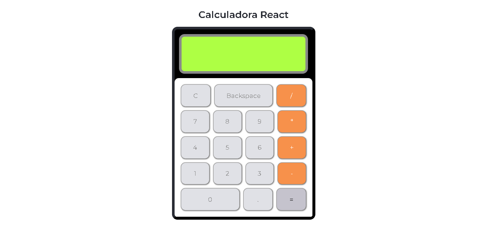

# Calculadora React

    

 
<h2>
    💻 Tecnologias
</h2>
<h3>
    <ul>
        <li>
            React
        </li>
        <li>
            CSS
        </li>
        <li>
            ViteJS
        </li>
        <li>
            MathJS
        </li>
    </ul>
</h3>